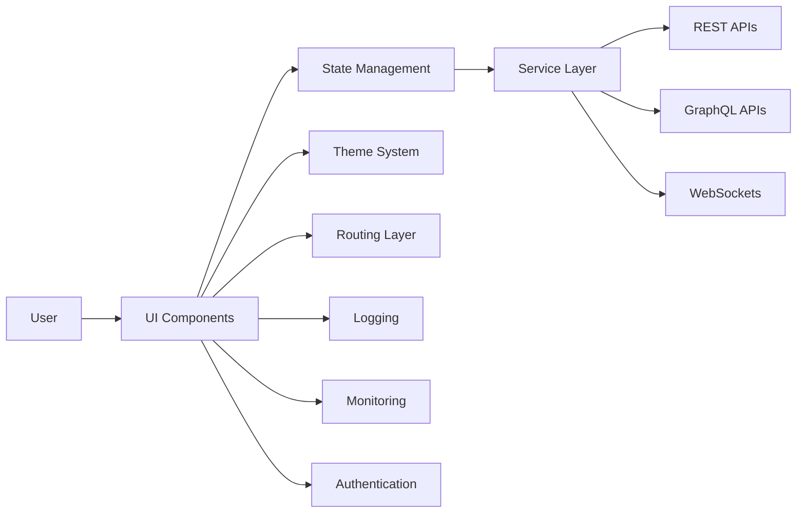
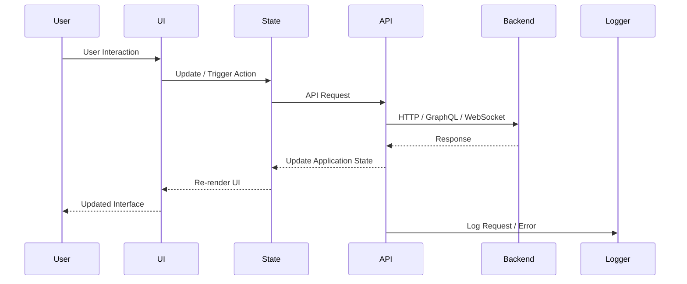
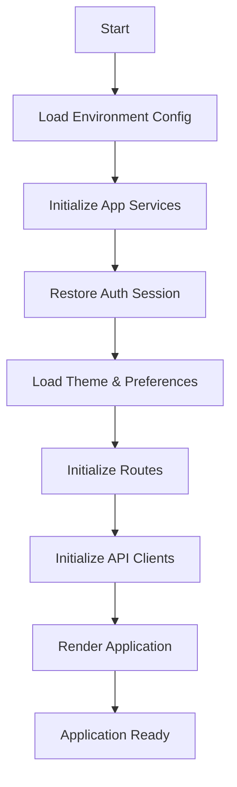

  

<h1 align="center">⚛️ Thynqit React Accelerator</h1>

  <b>Enterprise Frontend Architecture Blueprint</b>

  
  
  
  
  
  

---

## ⚠️ Usage & Licensing Notice

This repository is **public for reference purposes only**.

- 🚫 Forking is discouraged
- 🚫 External contributions are not accepted
- 🚫 Commercial or production use is not permitted
- ✅ Intended for understanding Thynqit's engineering practices

For collaboration or usage inquiries, please contact Thynqit at connect@thynqit.com.

---

## 📌 Overview

The **Thynqit React Accelerator** is an enterprise-grade frontend blueprint designed to standardize how scalable, maintainable, secure, and production-ready frontend applications should be architected, structured, developed, and deployed.

Unlike typical starter kits or UI boilerplates, this accelerator focuses on:

- ⚡ Rapid frontend development enablement  
- 🧩 Scalable component-driven architecture  
- 🎨 Consistent design system implementation  
- 🔒 Secure frontend engineering practices  
- 📱 Responsive and accessible user experiences  
- ☁️ Cloud-ready deployment architecture  
- 📊 Performance optimization and observability  

---

## ⚡ Architecture Snapshot

- Architecture: Component-Driven (UI → State → Services → APIs)
- Interfaces: REST, GraphQL, WebSockets
- Patterns: Modular, Reusable, Feature-Based
- UI System: Scalable Design System & Theme Support
- State Management: Context, React Query, Zustand/Redux-ready
- Routing: Protected, Role-Based, Layout-Driven Routing
- Performance: Lazy Loading, Caching, Code Splitting
- Infra: Docker-ready, Cloud-agnostic (AWS / Azure / GCP)
- Observability: Frontend Logging, Error Tracking, Monitoring
- Security: Authentication, Protected Routes, Permission-Based Access

---

## 🎯 Why This Matters

Modern frontend applications fail not because of UI frameworks—but because of inconsistent architecture, poor state management, weak scalability planning, and fragmented engineering practices.

This accelerator ensures:

- ✅ Consistent frontend architecture across projects  
- ✅ Faster onboarding of frontend developers  
- ✅ Reusable and scalable UI patterns  
- ✅ Reduced technical debt and UI inconsistencies  
- ✅ Production readiness from Day 1  
- ✅ Better performance, maintainability, and developer experience  

---

## 💼 Business Impact

Using this accelerator delivers measurable outcomes:

- 🚀 70–80% faster frontend project kickoff  
- 💰 Reduced UI development and maintenance cost  
- ⚡ Faster feature delivery and iteration cycles  
- 👨‍💻 Faster onboarding for frontend developers  
- 🎨 Consistent UI/UX implementation across applications  
- 📉 Reduced frontend bugs and production issues  
- 📱 Improved application performance and user experience  

---

## 🧭 Table of Contents

- [Overview](#-overview)
- [Architecture Snapshot](#-architecture-snapshot)
- [Why This Matters](#-why-this-matters)
- [Business Impact](#-business-impact)
- [Example Use Cases](#-example-use-cases)
- [Accelerator vs Traditional Setup](#-accelerator-vs-traditional-setup)
- [How Thynqit Uses This](#-how-thynqit-uses-this)
- [Core Principles](#-core-principles)
- [High-Level Architecture](#-high-level-architecture)
- [Request Flow](#-request-flow)
- [Application Flow](#-application-flow)
- [System Components](#-system-components)
- [Functional Capabilities](#-functional-capabilities)
- [Technology Stack Mapping](#-technology-stack-mapping)

- [Authentication Architecture](#-authentication-architecture)
- [Routing Architecture](#-routing-architecture)
- [State Management Strategy](#-state-management-strategy)
- [UI Component Architecture](#-ui-component-architecture)
- [Theme & Design System](#-theme--design-system)
- [Responsive Architecture](#-responsive-architecture)
- [Caching Strategy](#-caching-strategy)

- [Security Architecture](#-security-architecture)
- [Observability Architecture](#-observability-architecture)
- [Testing Strategy](#-testing-strategy)
- [Deployment Architecture](#-deployment-architecture)
- [Project Structure](#-project-structure)
- [Versioning](#-versioning)
- [Future Enhancements](#-future-enhancements)
- [Who Should Use This](#-who-should-use-this)
- [Engineering Philosophy](#-engineering-philosophy)
- [Work With Us](#-work-with-us)
- [Contributing](#-contributing)
- [License](#-license)

---

## 🧪 Example Use Cases

- SaaS Platforms (multi-tenant frontend dashboards and portals)  
- FinTech Applications (secure and responsive financial interfaces)  
- E-commerce Platforms (high-performance storefronts and customer experiences)  
- Admin & Analytics Dashboards (data-driven enterprise interfaces)  
- Internal Enterprise Applications (scalable business operation platforms)  
- Real-Time Applications (WebSocket-powered live updates and monitoring)  

---

## ⚖️ Accelerator vs Traditional Setup

| Traditional Setup            | Thynqit Accelerator                | Time / Effort Saved              |
| ---------------------------- | ---------------------------------- | -------------------------------- |
| Inconsistent UI architecture | Standardized frontend architecture | Faster decisions (1–2 weeks)    |
| Repeated project setup       | Pre-defined scalable structure     | Reduced setup time (2–3 weeks)  |
| Scattered API handling       | Centralized API integration layer  | Faster integration (1–2 weeks)  |
| Unstructured state handling  | Organized state management         | Reduced rework (continuous)     |
| Rebuilding common UI         | Reusable component system          | Faster UI development (1–2 weeks) |
| Weak performance planning    | Built-in optimization strategies   | Improved frontend performance   |
| Slow onboarding              | Consistent engineering standards   | Faster ramp-up (1–2 weeks)      |

*On average, teams can accelerate initial frontend setup by 70–80% using this accelerator.*

---

## 🏗️ How Thynqit Uses This

This accelerator is used internally across Thynqit frontend projects to:

- Kickstart scalable frontend applications within hours  
- Maintain UI and engineering consistency across teams  
- Deliver production-ready user interfaces faster  
- Standardize frontend architecture and development practices  
- Reduce repetitive setup and architectural decision overhead  
- Accelerate feature delivery with reusable frontend foundations  

---

## 🧱 Core Principles

It represents the foundational frontend architectural guidelines that shape how every application built using this accelerator is designed, structured, and scaled. These principles ensure a consistent, maintainable, and reusable frontend architecture from the outset, reducing UI inconsistencies, technical debt, and architectural fragmentation as applications grow in complexity.

### 🧩 Best Practices

- Component-Driven Architecture  
- Feature-Based Modular Structure  
- Reusable UI & Design Systems  
- Centralized State Management  
- API-First Frontend Integration  
- Responsive & Accessible Design  
- Performance Optimization by Default  
- Security by Design  
- Config-Driven Frontend Systems  

---

## 🏗️ High-Level Architecture

High-Level Architecture defines the overall structural blueprint of the frontend application by organizing it into clearly separated layers such as UI, state management, business logic, and API integration. This layered approach establishes clear boundaries of responsibility, ensuring that components, services, and application state can evolve independently without introducing unnecessary coupling or UI inconsistencies. By enforcing this structure, the accelerator enables scalability, maintainability, reusability, and flexibility, allowing teams to rapidly build and extend modern frontend applications while maintaining consistent engineering standards and user experience.

### 🧩 Best Practices

- Component-driven architecture  
- Feature-based modular structure  
- Reusable UI patterns  
- Centralized state management  
- API abstraction layer  
- Responsive-first design  
- Lazy loading and code splitting  
- Config-driven frontend systems  

---

## 🔁 Request Flow

Request Flow defines the standardized lifecycle of how user interactions and frontend requests move through the application—from UI components to state management, API communication, and back to the user interface as updated application state. Establishing a consistent flow ensures predictable frontend behavior, making the application easier to debug, monitor, maintain, and optimize. By structuring how requests are triggered, validated, processed, cached, and rendered, the accelerator improves traceability, performance, and developer experience while reducing inconsistent frontend implementations across teams.

### 🧩 Best Practices

- Smart separation between UI and business logic  
- Centralized API handling  
- Reusable hooks and services  
- Structured error handling  
- State-driven UI updates  
- Optimized request lifecycle management  

---

## 🔄 Application Flow

Application Flow defines the initialization lifecycle of the frontend application, outlining how configurations are loaded, dependencies are initialized, authentication state is restored, routes are prepared, and the user interface is rendered into a ready state. By standardizing this startup sequence, the accelerator ensures consistent and predictable behavior across environments such as development, staging, and production. This structured initialization improves frontend reliability, reduces runtime issues, ensures proper loading of critical application services, and enables a smoother user experience from the moment the application starts.

### 🧩 Best Practices

- Environment configuration validation  
- Centralized application initialization  
- Authentication/session restoration  
- Route and permission initialization  
- Lazy loading and code splitting  
- Graceful error handling  
- Theme and preference persistence  

---

## 🧩 System Components

### 🎨 UI Layer

The UI Layer represents the visual foundation of the application, responsible for rendering components, handling user interactions, and delivering a consistent user experience across devices and screen sizes. It focuses on reusable, modular, and scalable component architecture, enabling teams to rapidly build interfaces while maintaining design consistency, accessibility, and responsiveness across the application.

#### 🧩 Components

- Reusable UI Components  
- Layout Systems  
- Forms & Inputs  
- Modals & Dialogs  
- Responsive UI  
- Theme Support  
- Design Tokens  

### ⚙️ State & Business Layer

The State & Business Layer manages application state, frontend workflows, business rules, and UI-driven logic. It acts as the coordination layer between the user interface and backend integrations, ensuring predictable state transitions, reusable business logic, and maintainable frontend architecture. By centralizing state and separating concerns, this layer improves scalability, debugging, and developer productivity.

#### 📌 Responsibilities

- Global State Management  
- Authentication State  
- Theme State  
- Business Logic Handling  
- UI State Synchronization  
- Data Transformation  
- Permission & Role Handling  

### 🌐 API Integration Layer

The API Integration Layer manages all communication between the frontend application and external backend systems. It abstracts API requests, authentication handling, error processing, caching strategies, and real-time communication, ensuring that frontend components remain decoupled from low-level networking logic. This centralized approach simplifies integrations and improves maintainability, consistency, and scalability.

#### 🧩 Components

- REST API Clients  
- GraphQL Clients  
- WebSocket Clients  
- Request/Response Interceptors  
- API Service Modules  
- Query & Mutation Management  
- Error Handling  

### 🔗 Cross-Cutting Concerns

Cross-Cutting Concerns represent shared frontend capabilities that span across all layers of the application, ensuring consistency, reliability, security, and operational excellence. These include centralized logging, monitoring, error handling, caching, authentication, performance optimization, and responsive behavior management. Together, these capabilities provide improved visibility, maintainability, user experience, and production readiness across frontend applications.

#### 📌 Responsibilities

- Logging & Error Tracking  
- Monitoring & Observability  
- Authentication & Route Protection  
- Caching & Offline Support  
- Responsive Design Handling  
- Theme & Preference Persistence  
- Performance Optimization  
- Accessibility & UX Standards  

---

## ⚙️ Functional Capabilities

The accelerator provides a comprehensive set of frontend engineering capabilities that establish a scalable, maintainable, and production-ready foundation for modern React applications. By standardizing critical frontend concerns such as UI architecture, state management, API integration, responsiveness, testing, deployment, and observability, it enables teams to accelerate development while maintaining high engineering quality, consistent user experience, and long-term maintainability.

### 🧩 Capabilities

| Capability            | Description                                      | Impact                    |
| --------------------- | ------------------------------------------------ | ------------------------- |
| Environment           | Multi-env support (dev, qa, prod)                | Stability                 |
| Configuration         | Centralized frontend configuration               | Flexibility               |
| Authentication        | Login, session, and route protection             | Security                  |
| Routing               | Protected and layout-based routing               | Scalability               |
| State Management      | Global and feature-level state handling          | Predictability            |
| API Integration       | REST, GraphQL, and WebSocket support             | Faster integrations       |
| UI Component System   | Reusable and scalable component architecture     | Faster UI development     |
| Theme Support         | Centralized theming and dark/light mode          | Consistent UX             |
| Responsive Design     | Mobile, tablet, and desktop adaptability         | Better user experience    |
| Caching               | API and client-side caching strategies           | Performance optimization  |
| Monitoring & Logging  | Frontend observability and error tracking        | Faster debugging          |
| Containerization      | Docker-ready frontend setup                      | Easy deployment           |
| Testing               | Unit, integration, and E2E testing               | Reduced frontend bugs     |
| CI/CD                 | GitHub Actions / Jenkins                         | Faster releases           |
| Cloud                 | AWS / Azure / GCP deployment support             | Cloud agnostic            |

---

## 🛠️ Technology Stack Mapping

The accelerator is built using a carefully selected set of industry-proven frontend tools and frameworks to ensure scalability, maintainability, performance, and developer productivity across all layers of the application.

| Capability            | Tools / Frameworks                              | Purpose                                        |
| --------------------- | ------------------------------------------------ | ---------------------------------------------- |
| Framework             | ReactJS, Vite                                    | Scalable and high-performance frontend setup   |
| Language              | TypeScript                                       | Type safety and maintainability                |
| Routing               | React Router                                     | Frontend routing and navigation                |
| State Management      | Context API, Zustand, Redux Toolkit              | Global and feature-level state management      |
| API Integration       | Axios, Fetch API                                 | Centralized API communication                  |
| GraphQL               | Apollo Client                                    | GraphQL query and mutation support             |
| WebSockets            | Socket.IO Client / Native WebSocket              | Real-time communication                        |
| Authentication        | JWT                                              | Authentication and session management          |
| UI Framework          | Material UI / Tailwind CSS                       | Scalable and reusable UI system                |
| Forms & Validation    | React Hook Form, Zod / Yup                       | Form handling and validation                   |
| Theme System          | Context API, CSS Variables, Tailwind Theme       | Theme and dark/light mode support              |
| Caching               | React Query / TanStack Query                     | API caching and server-state management        |
| Logging               | Custom Logger Utilities                          | Standardized frontend logging                  |
| Monitoring            | Sentry, LogRocket                                | Frontend error tracking and observability      |
| Testing               | Jest, React Testing Library, Cypress             | Unit, integration, and E2E testing             |
| CI/CD                 | GitHub Actions, Jenkins                          | Build, test, and deployment automation         |
| Containerization      | Docker                                           | Consistent frontend runtime environment        |
| Cloud                 | AWS / Azure / GCP                                | Cloud deployment                               |
| Build & Bundling      | Vite, Webpack                                    | Optimized frontend build pipeline              |
| API Documentation     | Swagger, GraphQL Playground                      | Backend API contract reference                 |
| Linting & Formatting  | ESLint, Prettier                                 | Code quality and consistency                   |
| Git Hooks             | Husky, lint-staged                               | Pre-commit validation and formatting           |
| Push Notifications    | Firebase Cloud Messaging (FCM)                   | Browser push notification support              |
| Environment Config    | dotenv, Vite Environment Variables               | Multi-environment configuration management     |
| Accessibility         | ARIA, axe-core                                   | Accessibility compliance and validation        |

---