<p align="center">
  
</p>

<h1 align="center">⚛️ Thynqit React Accelerator</h1>

<p align="center">
  <b>Enterprise Frontend Architecture Blueprint</b>
</p>

<p align="center">
  
  
  
  
  
  
</p>

---

## ⚠️ Usage & Licensing Notice

This repository is **public for reference purposes only**.

- 🚫 Forking is discouraged
- 🚫 External contributions are not accepted
- 🚫 Commercial or production use is not permitted
- ✅ Intended for understanding Thynqit's engineering practices

For collaboration or usage inquiries, please contact Thynqit at connect@thynqit.com.

---

## 📌 Overview

The **Thynqit React Accelerator** is an enterprise-grade frontend blueprint designed to standardize how scalable, maintainable, secure, and production-ready frontend applications should be architected, structured, developed, and deployed.

Unlike typical starter kits or UI boilerplates, this accelerator focuses on:

- ⚡ Rapid frontend development enablement  
- 🧩 Scalable component-driven architecture  
- 🎨 Consistent design system implementation  
- 🔒 Secure frontend engineering practices  
- 📱 Responsive and accessible user experiences  
- ☁️ Cloud-ready deployment architecture  
- 📊 Performance optimization and observability  

---

## ⚡ Architecture Snapshot

- Architecture: Component-Driven (UI → State → Services → APIs)
- Interfaces: REST, GraphQL, WebSockets
- Patterns: Modular, Reusable, Feature-Based
- UI System: Scalable Design System & Theme Support
- State Management: Context, React Query, Zustand/Redux-ready
- Routing: Protected, Role-Based, Layout-Driven Routing
- Performance: Lazy Loading, Caching, Code Splitting
- Infra: Docker-ready, Cloud-agnostic (AWS / Azure / GCP)
- Observability: Frontend Logging, Error Tracking, Monitoring
- Security: Authentication, Protected Routes, Permission-Based Access

---

## 🎯 Why This Matters

Modern frontend applications fail not because of UI frameworks—but because of inconsistent architecture, poor state management, weak scalability planning, and fragmented engineering practices.

This accelerator ensures:

- ✅ Consistent frontend architecture across projects  
- ✅ Faster onboarding of frontend developers  
- ✅ Reusable and scalable UI patterns  
- ✅ Reduced technical debt and UI inconsistencies  
- ✅ Production readiness from Day 1  
- ✅ Better performance, maintainability, and developer experience  

---

## 💼 Business Impact

Using this accelerator delivers measurable outcomes:

- 🚀 70–80% faster frontend project kickoff  
- 💰 Reduced UI development and maintenance cost  
- ⚡ Faster feature delivery and iteration cycles  
- 👨‍💻 Faster onboarding for frontend developers  
- 🎨 Consistent UI/UX implementation across applications  
- 📉 Reduced frontend bugs and production issues  
- 📱 Improved application performance and user experience  

---

## 🧭 Table of Contents

- [Overview](#-overview)
- [Architecture Snapshot](#-architecture-snapshot)
- [Why This Matters](#-why-this-matters)
- [Business Impact](#-business-impact)
- [Example Use Cases](#-example-use-cases)
- [Accelerator vs Traditional Setup](#-accelerator-vs-traditional-setup)
- [How Thynqit Uses This](#-how-thynqit-uses-this)
- [Core Principles](#-core-principles)
- [High-Level Architecture](#-high-level-architecture)
- [Request Flow](#-request-flow)
- [Application Flow](#-application-flow)
- [System Components](#-system-components)
- [Functional Capabilities](#-functional-capabilities)
- [Technology Stack Mapping](#-technology-stack-mapping)
- [Authentication Architecture](#-authentication-architecture)
- [Routing Architecture](#-routing-architecture)
- [State Management Strategy](#-state-management-strategy)
- [UI Component Architecture](#-ui-component-architecture)
- [Theme & Design System](#-theme--design-system)
- [Responsive Architecture](#-responsive-architecture)
- [Caching Strategy](#-caching-strategy)


- [Security Architecture](#-security-architecture)
- [Observability Architecture](#-observability-architecture)
- [Testing Strategy](#-testing-strategy)
- [Deployment Architecture](#-deployment-architecture)
- [Project Structure](#-project-structure)
- [Versioning](#-versioning)
- [Future Enhancements](#-future-enhancements)
- [Who Should Use This](#-who-should-use-this)
- [Engineering Philosophy](#-engineering-philosophy)
- [Work With Us](#-work-with-us)
- [Contributing](#-contributing)
- [License](#-license)

---

## 🧪 Example Use Cases

- SaaS Platforms (multi-tenant frontend dashboards and portals)  
- FinTech Applications (secure and responsive financial interfaces)  
- E-commerce Platforms (high-performance storefronts and customer experiences)  
- Admin & Analytics Dashboards (data-driven enterprise interfaces)  
- Internal Enterprise Applications (scalable business operation platforms)  
- Real-Time Applications (WebSocket-powered live updates and monitoring)  

---

## ⚖️ Accelerator vs Traditional Setup

| Traditional Setup            | Thynqit Accelerator                | Time / Effort Saved              |
| ---------------------------- | ---------------------------------- | -------------------------------- |
| Inconsistent UI architecture | Standardized frontend architecture | Faster decisions (1–2 weeks)    |
| Repeated project setup       | Pre-defined scalable structure     | Reduced setup time (2–3 weeks)  |
| Scattered API handling       | Centralized API integration layer  | Faster integration (1–2 weeks)  |
| Unstructured state handling  | Organized state management         | Reduced rework (continuous)     |
| Rebuilding common UI         | Reusable component system          | Faster UI development (1–2 weeks) |
| Weak performance planning    | Built-in optimization strategies   | Improved frontend performance   |
| Slow onboarding              | Consistent engineering standards   | Faster ramp-up (1–2 weeks)      |

*On average, teams can accelerate initial frontend setup by 70–80% using this accelerator.*

---

## 🏗️ How Thynqit Uses This

This accelerator is used internally across Thynqit frontend projects to:

- Kickstart scalable frontend applications within hours  
- Maintain UI and engineering consistency across teams  
- Deliver production-ready user interfaces faster  
- Standardize frontend architecture and development practices  
- Reduce repetitive setup and architectural decision overhead  
- Accelerate feature delivery with reusable frontend foundations  

---

## 🧱 Core Principles

It represents the foundational frontend architectural guidelines that shape how every application built using this accelerator is designed, structured, and scaled. These principles ensure a consistent, maintainable, and reusable frontend architecture from the outset, reducing UI inconsistencies, technical debt, and architectural fragmentation as applications grow in complexity.

### 🧩 Best Practices

- Component-Driven Architecture  
- Feature-Based Modular Structure  
- Reusable UI & Design Systems  
- Centralized State Management  
- API-First Frontend Integration  
- Responsive & Accessible Design  
- Performance Optimization by Default  
- Security by Design  
- Config-Driven Frontend Systems  

---

## 🏗️ High-Level Architecture

High-Level Architecture defines the overall structural blueprint of the frontend application by organizing it into clearly separated layers such as UI, state management, business logic, and API integration. This layered approach establishes clear boundaries of responsibility, ensuring that components, services, and application state can evolve independently without introducing unnecessary coupling or UI inconsistencies. By enforcing this structure, the accelerator enables scalability, maintainability, reusability, and flexibility, allowing teams to rapidly build and extend modern frontend applications while maintaining consistent engineering standards and user experience.

### 🧩 Best Practices

- Component-driven architecture  
- Feature-based modular structure  
- Reusable UI patterns  
- Centralized state management  
- API abstraction layer  
- Responsive-first design  
- Lazy loading and code splitting  
- Config-driven frontend systems  

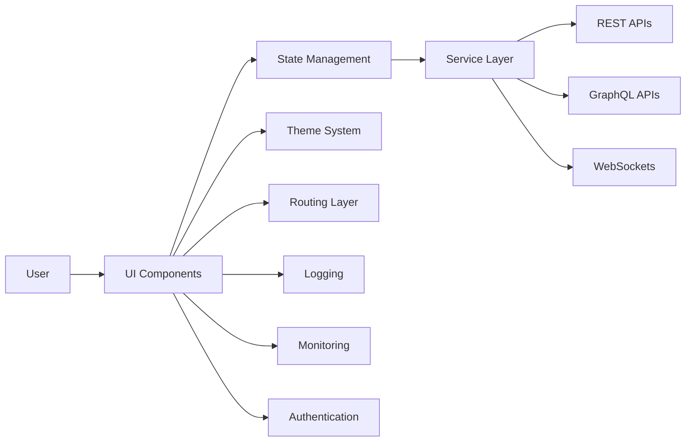

---

## 🔁 Request Flow

Request Flow defines the standardized lifecycle of how user interactions and frontend requests move through the application—from UI components to state management, API communication, and back to the user interface as updated application state. Establishing a consistent flow ensures predictable frontend behavior, making the application easier to debug, monitor, maintain, and optimize. By structuring how requests are triggered, validated, processed, cached, and rendered, the accelerator improves traceability, performance, and developer experience while reducing inconsistent frontend implementations across teams.

### 🧩 Best Practices

- Smart separation between UI and business logic  
- Centralized API handling  
- Reusable hooks and services  
- Structured error handling  
- State-driven UI updates  
- Optimized request lifecycle management  

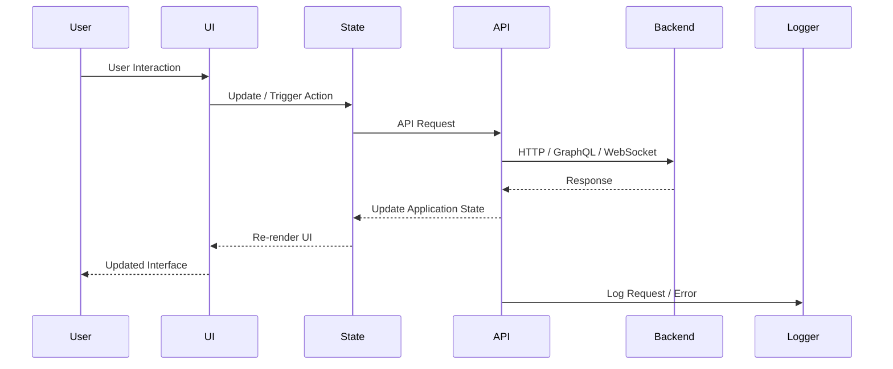

---

## 🔄 Application Flow

Application Flow defines the initialization lifecycle of the frontend application, outlining how configurations are loaded, dependencies are initialized, authentication state is restored, routes are prepared, and the user interface is rendered into a ready state. By standardizing this startup sequence, the accelerator ensures consistent and predictable behavior across environments such as development, staging, and production. This structured initialization improves frontend reliability, reduces runtime issues, ensures proper loading of critical application services, and enables a smoother user experience from the moment the application starts.

### 🧩 Best Practices

- Environment configuration validation  
- Centralized application initialization  
- Authentication/session restoration  
- Route and permission initialization  
- Lazy loading and code splitting  
- Graceful error handling  
- Theme and preference persistence  

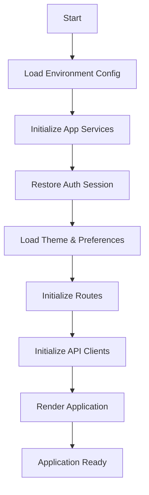

---

## 🧩 System Components

### 🎨 UI Layer

The UI Layer represents the visual foundation of the application, responsible for rendering components, handling user interactions, and delivering a consistent user experience across devices and screen sizes. It focuses on reusable, modular, and scalable component architecture, enabling teams to rapidly build interfaces while maintaining design consistency, accessibility, and responsiveness across the application.

#### 🧩 Components

- Reusable UI Components  
- Layout Systems  
- Forms & Inputs  
- Modals & Dialogs  
- Responsive UI  
- Theme Support  
- Design Tokens  

### ⚙️ State & Business Layer

The State & Business Layer manages application state, frontend workflows, business rules, and UI-driven logic. It acts as the coordination layer between the user interface and backend integrations, ensuring predictable state transitions, reusable business logic, and maintainable frontend architecture. By centralizing state and separating concerns, this layer improves scalability, debugging, and developer productivity.

#### 📌 Responsibilities

- Global State Management  
- Authentication State  
- Theme State  
- Business Logic Handling  
- UI State Synchronization  
- Data Transformation  
- Permission & Role Handling  

### 🌐 API Integration Layer

The API Integration Layer manages all communication between the frontend application and external backend systems. It abstracts API requests, authentication handling, error processing, caching strategies, and real-time communication, ensuring that frontend components remain decoupled from low-level networking logic. This centralized approach simplifies integrations and improves maintainability, consistency, and scalability.

#### 🧩 Components

- REST API Clients  
- GraphQL Clients  
- WebSocket Clients  
- Request/Response Interceptors  
- API Service Modules  
- Query & Mutation Management  
- Error Handling  

### 🔗 Cross-Cutting Concerns

Cross-Cutting Concerns represent shared frontend capabilities that span across all layers of the application, ensuring consistency, reliability, security, and operational excellence. These include centralized logging, monitoring, error handling, caching, authentication, performance optimization, and responsive behavior management. Together, these capabilities provide improved visibility, maintainability, user experience, and production readiness across frontend applications.

#### 📌 Responsibilities

- Logging & Error Tracking  
- Monitoring & Observability  
- Authentication & Route Protection  
- Caching & Offline Support  
- Responsive Design Handling  
- Theme & Preference Persistence  
- Performance Optimization  
- Accessibility & UX Standards  

---

## ⚙️ Functional Capabilities

The accelerator provides a comprehensive set of frontend engineering capabilities that establish a scalable, maintainable, and production-ready foundation for modern React applications. By standardizing critical frontend concerns such as UI architecture, state management, API integration, responsiveness, testing, deployment, and observability, it enables teams to accelerate development while maintaining high engineering quality, consistent user experience, and long-term maintainability.

### 🧩 Capabilities

| Capability            | Description                                      | Impact                    |
| --------------------- | ------------------------------------------------ | ------------------------- |
| Environment           | Multi-env support (dev, qa, prod)                | Stability                 |
| Configuration         | Centralized frontend configuration               | Flexibility               |
| Authentication        | Login, session, and route protection             | Security                  |
| Routing               | Protected and layout-based routing               | Scalability               |
| State Management      | Global and feature-level state handling          | Predictability            |
| API Integration       | REST, GraphQL, and WebSocket support             | Faster integrations       |
| UI Component System   | Reusable and scalable component architecture     | Faster UI development     |
| Theme Support         | Centralized theming and dark/light mode          | Consistent UX             |
| Responsive Design     | Mobile, tablet, and desktop adaptability         | Better user experience    |
| Caching               | API and client-side caching strategies           | Performance optimization  |
| Monitoring & Logging  | Frontend observability and error tracking        | Faster debugging          |
| Containerization      | Docker-ready frontend setup                      | Easy deployment           |
| Testing               | Unit, integration, and E2E testing               | Reduced frontend bugs     |
| CI/CD                 | GitHub Actions / Jenkins                         | Faster releases           |
| Cloud                 | AWS / Azure / GCP deployment support             | Cloud agnostic            |

---

## 🛠️ Technology Stack Mapping

The accelerator is built using a carefully selected set of industry-proven frontend tools and frameworks to ensure scalability, maintainability, performance, and developer productivity across all layers of the application.

| Capability            | Tools / Frameworks                              | Purpose                                        |
| --------------------- | ------------------------------------------------ | ---------------------------------------------- |
| Framework             | ReactJS, Vite                                    | Scalable and high-performance frontend setup   |
| Language              | TypeScript                                       | Type safety and maintainability                |
| Routing               | React Router                                     | Frontend routing and navigation                |
| State Management      | Context API, Zustand, Redux Toolkit              | Global and feature-level state management      |
| API Integration       | Axios, Fetch API                                 | Centralized API communication                  |
| GraphQL               | Apollo Client                                    | GraphQL query and mutation support             |
| WebSockets            | Socket.IO Client / Native WebSocket              | Real-time communication                        |
| Authentication        | JWT                                              | Authentication and session management          |
| UI Framework          | Material UI / Tailwind CSS                       | Scalable and reusable UI system                |
| Forms & Validation    | React Hook Form, Zod / Yup                       | Form handling and validation                   |
| Theme System          | Context API, CSS Variables, Tailwind Theme       | Theme and dark/light mode support              |
| Caching               | React Query / TanStack Query                     | API caching and server-state management        |
| Logging               | Custom Logger Utilities                          | Standardized frontend logging                  |
| Monitoring            | Sentry, LogRocket                                | Frontend error tracking and observability      |
| Testing               | Jest, React Testing Library, Cypress             | Unit, integration, and E2E testing             |
| CI/CD                 | GitHub Actions, Jenkins                          | Build, test, and deployment automation         |
| Containerization      | Docker                                           | Consistent frontend runtime environment        |
| Cloud                 | AWS / Azure / GCP                                | Cloud deployment                               |
| Build & Bundling      | Vite, Webpack                                    | Optimized frontend build pipeline              |
| API Documentation     | Swagger, GraphQL Playground                      | Backend API contract reference                 |
| Linting & Formatting  | ESLint, Prettier                                 | Code quality and consistency                   |
| Git Hooks             | Husky, lint-staged                               | Pre-commit validation and formatting           |
| Push Notifications    | Firebase Cloud Messaging (FCM)                   | Browser push notification support              |
| Environment Config    | dotenv, Vite Environment Variables               | Multi-environment configuration management     |
| Accessibility         | ARIA, axe-core                                   | Accessibility compliance and validation        |

---

## 🔐 Authentication Architecture

Authentication Architecture defines how user identity, session management, route protection, and access control are handled across the frontend application. The accelerator provides a scalable and extensible authentication foundation that supports secure login flows, protected routes, token/session handling, and permission-based UI rendering while remaining flexible enough to integrate with different backend authentication providers and enterprise identity systems.

By centralizing authentication concerns, the accelerator ensures consistent security practices, improves developer productivity, and reduces the complexity of implementing authentication repeatedly across projects. The architecture is designed to support both current authentication requirements and future expansion such as OAuth providers, social login, multi-factor authentication, and advanced enterprise access control systems.

### 🧩 Best Practices

- Centralized authentication management  
- Protected and role-based routing  
- Secure token and session handling  
- Permission-based UI rendering  
- Authentication state persistence  
- Environment-driven authentication configuration  
- Graceful session expiration handling  
- Extensible authentication provider support  

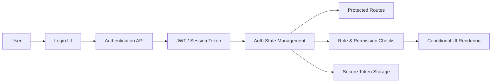

---

## 🛣️ Routing Architecture

Routing Architecture defines how navigation, layouts, access control, and page transitions are structured across the frontend application. The accelerator provides a scalable and centralized routing system that supports public routes, protected routes, role-based access control, nested routing, layout-driven navigation, and dynamic route handling while maintaining a clean and maintainable frontend architecture.

By standardizing routing behavior, the accelerator ensures consistent navigation patterns, improves user experience, simplifies permission management, and enables large applications to scale without introducing fragmented routing logic. The architecture is designed to support modern frontend requirements such as lazy loading, code splitting, and route-level performance optimization.

### 🧩 Best Practices

- Centralized route configuration  
- Protected and role-based routes  
- Layout-driven routing architecture  
- Nested and modular route organization  
- Lazy loading and route-based code splitting  
- Graceful fallback and 404 handling  
- Dynamic route support  
- Scalable route grouping by feature/module  

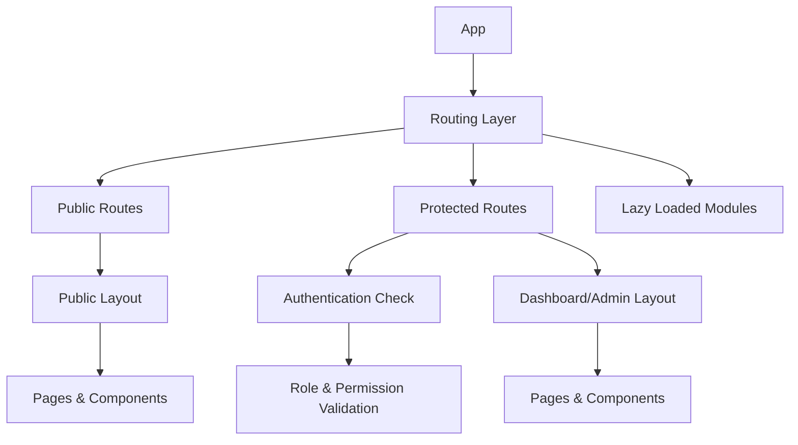

---

## 🗂️ State Management Strategy

State Management Strategy defines how application data, UI state, authentication state, and server-side data are managed across the frontend application. The accelerator provides a scalable and flexible state management approach that separates local UI state, global application state, and API/server state to ensure predictable behavior, maintainability, and performance as the application grows.

Instead of enforcing a single state management library for all scenarios, the architecture promotes choosing the right approach based on actual application complexity and business requirements. This strategy enables teams to avoid unnecessary complexity during early stages while still supporting enterprise-scale state management patterns when needed.

### 🧩 Best Practices

- Separation of local, global, and server state  
- Minimal and scalable state architecture  
- Centralized authentication and theme state  
- API caching and query management  
- Predictable state updates and synchronization  
- Feature-based state organization  
- Avoid unnecessary global state usage  
- Optimized re-render and performance handling  

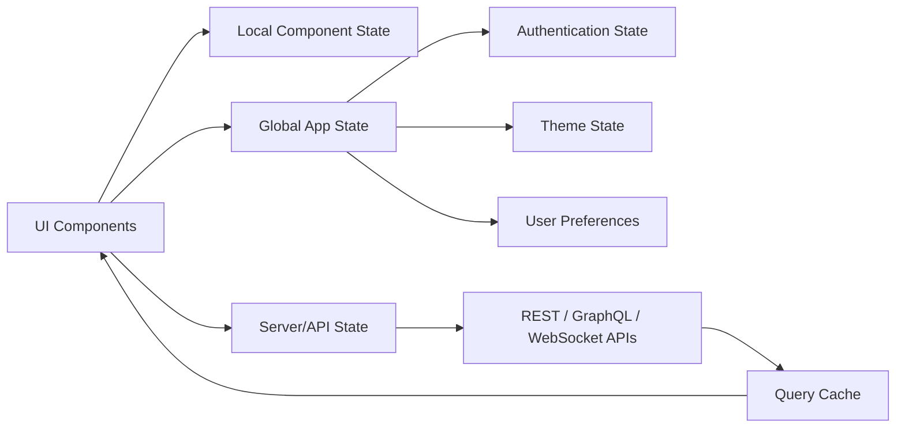

---

## 🎨 UI Component Architecture

UI Component Architecture defines how reusable frontend components are designed, organized, and scaled across the application. The accelerator promotes a component-driven architecture where UI elements are built as modular, reusable, and composable units, enabling teams to maintain design consistency, accelerate development, and simplify long-term maintenance.

By standardizing component structure, styling patterns, and interaction behavior, the accelerator reduces duplicated UI logic and ensures a predictable development experience across teams. The architecture is designed to support scalable design systems, responsive layouts, accessibility standards, and theme compatibility while allowing frontend applications to evolve without creating fragmented user interfaces.

### 🧩 Best Practices

- Reusable and composable components  
- Feature-based component organization  
- Separation of presentation and business logic  
- Consistent design system usage  
- Theme-aware component development  
- Responsive and accessible UI patterns  
- Minimal prop drilling and clean interfaces  
- Shared component documentation and standards  

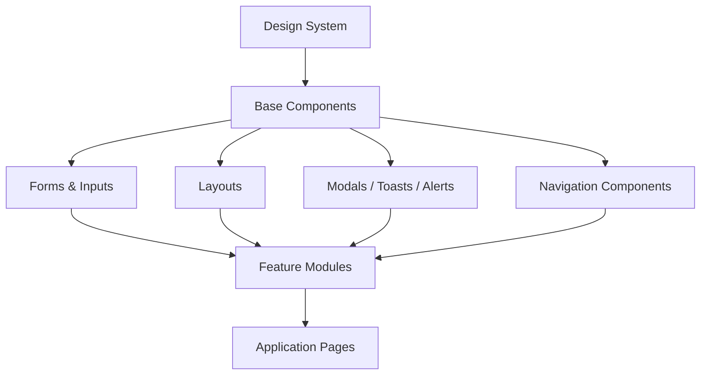

---

## 🎨 Theme & Design System

Theme & Design System defines the visual foundation of the frontend application by standardizing colors, typography, spacing, layouts, component styling, and interaction behavior across the entire system. The accelerator provides a scalable and centralized design system approach that ensures UI consistency, improves developer productivity, and enables applications to maintain a cohesive user experience as they grow.

By establishing reusable design tokens, theme-aware components, and centralized styling patterns, the accelerator simplifies UI customization, supports light and dark mode implementations, and reduces inconsistencies across teams and projects. The architecture is designed to support responsive design, accessibility standards, and scalable enterprise-grade frontend systems.

### 🧩 Best Practices

- Centralized design tokens and theme configuration  
- Reusable and theme-aware UI components  
- Light and dark mode support  
- Consistent typography, spacing, and color systems  
- Responsive-first design principles  
- Accessibility-focused UI standards  
- Scalable styling architecture  
- Shared UI and branding consistency across applications  

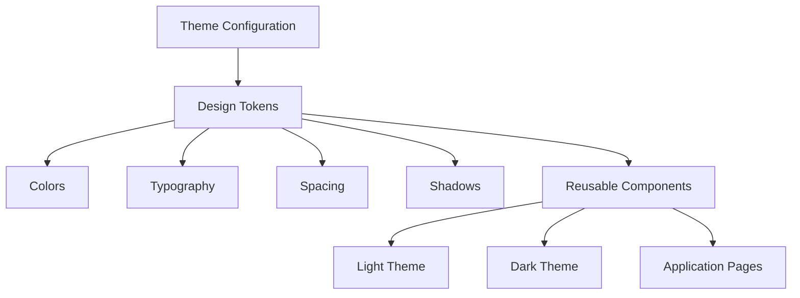

---

## 📱 Responsive Architecture

Responsive Architecture defines how the frontend application adapts seamlessly across different devices, screen sizes, and user interaction patterns. The accelerator provides a scalable responsive design foundation that ensures consistent user experience across mobile, tablet, laptop, and desktop environments without requiring duplicated UI implementations for each device type.

By standardizing responsive layouts, adaptive components, breakpoint management, and device-aware behaviors, the accelerator enables teams to build flexible and maintainable interfaces that remain performant and visually consistent across platforms. The architecture is designed to support responsive navigation, dynamic layouts, configurable device support, and modern mobile-first frontend engineering practices.

### 🧩 Best Practices

- Mobile-first responsive design  
- Centralized breakpoint management  
- Adaptive layouts and navigation systems  
- Responsive and reusable UI components  
- Device-aware rendering strategies  
- Optimized performance for different screen sizes  
- Configurable responsive behavior flags  
- Consistent cross-device user experience  

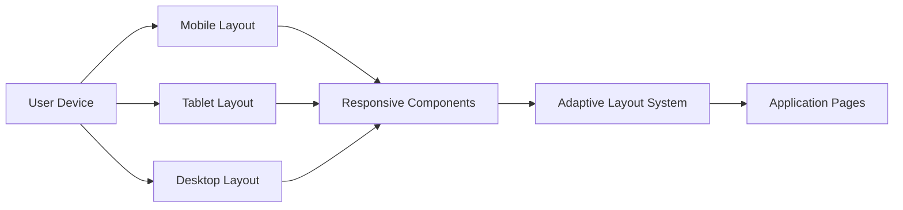

---

## ⚡ Caching Strategy

Caching Strategy defines how frontend data, API responses, and application state are temporarily stored and reused to improve performance, reduce unnecessary network requests, and enhance user experience. The accelerator provides a scalable caching foundation that supports server-state caching, browser storage strategies, offline-friendly behavior, and intelligent data synchronization across the application.

By standardizing caching mechanisms and cache lifecycle management, the accelerator enables faster page interactions, smoother user experiences, reduced backend load, and improved application responsiveness. The architecture is designed to support modern frontend performance practices such as query caching, cache invalidation, background refetching, and persistent client-side storage.

### 🧩 Best Practices

- Query and API response caching  
- Intelligent cache invalidation strategies  
- Local and session storage management  
- Background data refetching  
- Optimized API request deduplication  
- Offline-friendly frontend behavior  
- Controlled cache expiration policies  
- Minimal unnecessary network requests  

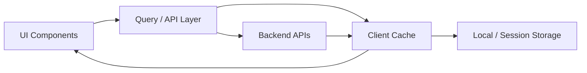

---

## 🔐 Security Architecture

The accelerator embeds security as a foundational layer across the frontend application, ensuring that authentication, authorization, session handling, and client-side protections are integrated from the beginning rather than treated as optional add-ons. It establishes a consistent and scalable frontend security model that safeguards user interactions, API communication, route access, and sensitive application flows while maintaining a seamless user experience.

By standardizing frontend security practices, the accelerator reduces the risk of common vulnerabilities such as unauthorized access, insecure token handling, XSS attacks, and inconsistent permission enforcement. This approach enables teams to build secure, enterprise-grade frontend applications while remaining flexible enough to support modern authentication providers and evolving security requirements.

### 🧩 Best Practices

- Secure authentication and session management  
- Protected and role-based route access  
- Permission-based UI rendering  
- Secure token storage and handling  
- Input sanitization and validation  
- Environment-based security configuration  
- Graceful session expiration handling  
- Secure API communication practices  

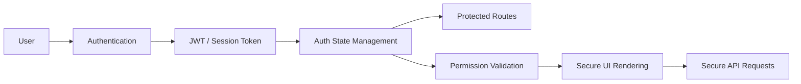

---

## 📊 Observability Architecture

The accelerator integrates observability as a core frontend capability, ensuring that applications have built-in visibility into user interactions, runtime behavior, API failures, performance bottlenecks, and client-side errors. By standardizing frontend logging, monitoring, error tracking, and performance analytics, the accelerator enables teams to diagnose issues faster, improve application reliability, and continuously optimize user experience across environments.

This proactive observability approach helps teams detect frontend issues early, reduce production debugging effort, improve performance monitoring, and maintain operational transparency as applications scale in complexity and user traffic.

### 🧩 Best Practices

- Centralized frontend logging  
- Global error tracking and monitoring  
- API request and failure monitoring  
- User interaction and event tracking  
- Performance monitoring and analytics  
- Environment-aware logging strategies  
- Real-time issue visibility and diagnostics  
- Observability integration readiness  

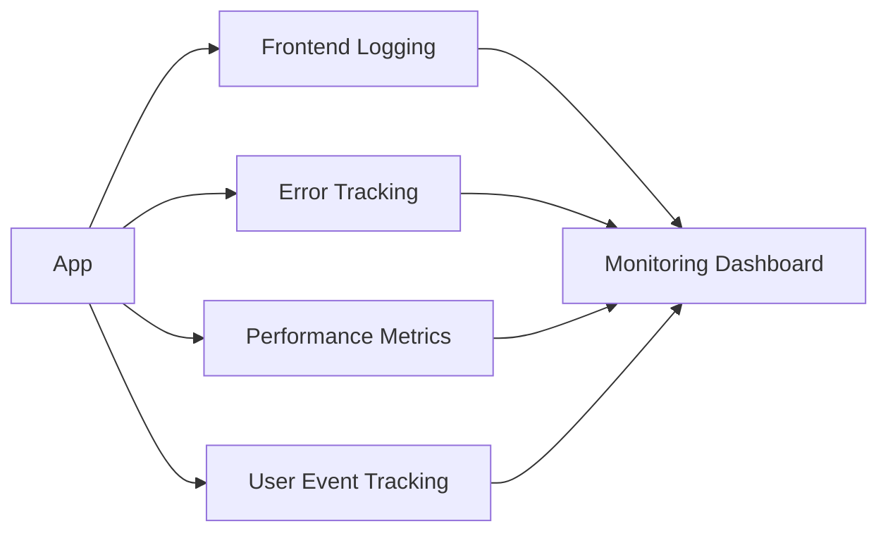

---

## 🧪 Testing Strategy

The accelerator embeds a comprehensive frontend testing strategy as a core part of the development lifecycle, ensuring that reliability, usability, and quality are built into every application from the start. By standardizing frontend testing practices across components, user flows, APIs, and integrations, it enables teams to detect issues early, prevent regressions, and maintain confidence in every release while improving long-term maintainability.

This approach reduces frontend production issues, improves user experience quality, and supports faster, safer deployments as applications evolve in complexity and scale.

### 🧩 Best Practices

- Unit Testing for components, hooks, and utilities  
- Integration Testing for connected frontend flows  
- End-to-End Testing for critical user journeys  
- API and service mocking for isolated testing  
- Reusable test utilities and fixtures  
- Automated CI/CD test execution  
- Coverage reporting and quality validation  
- Consistent frontend testing standards  

---

## ☁️ Deployment Architecture

The accelerator defines a standardized frontend deployment architecture that streamlines the journey from source code to production-ready frontend applications. By embedding deployment automation, environment management, build optimization, and containerization into the foundation, it enables teams to deliver frontend changes consistently, reliably, and efficiently across multiple environments and cloud platforms.

This approach minimizes deployment risks, improves operational consistency, supports scalable frontend delivery pipelines, and ensures that applications remain optimized for performance, reliability, and maintainability as they evolve.

### 🧩 Best Practices

- Automated CI/CD pipelines  
- Environment-based frontend configurations  
- Optimized production builds  
- Dockerized frontend deployments  
- Cloud-agnostic deployment strategy  
- Static asset optimization and caching  
- Automated testing before deployment  
- Consistent build and release workflows  


---

## 📂 Project Structure

The accelerator follows a clean, scalable, and modular frontend project structure designed to separate concerns and support long-term maintainability across enterprise-grade React applications. The structure standardizes how configurations, shared utilities, reusable UI components, state management, services, feature modules, themes, and tests are organized, ensuring consistency across teams and projects while keeping the root level minimal and easy to navigate.

Documentation and reusable templates are maintained independently to standardize frontend engineering practices, while the src directory is organized into clearly defined layers such as configuration, shared components, core infrastructure, services, feature modules, state management, themes, and testing utilities. This modular structure enables frontend applications to scale predictably while supporting modern frontend capabilities such as REST, GraphQL, WebSockets, responsive design systems, authentication flows, and cloud-ready deployments within a consistent architectural framework.

```plaintext
.husky/                        # Git hooks 
│   ├── pre-commit             # Pre-commit hook for lint-staged checks 
│   └── pre-push               # Pre-push hook for lint-staged checks 
.github/                       # GitHub-related configuration 
│   └── workflows/             # GitHub Actions workflows 
│       └── ci-cd.yml          # CI/CD pipeline for build, test, report, deploy 
jenkins/                       # Jenkins-related configuration 
│   └── Jenkinsfile            # Jenkins CI/CD pipeline file
allure-results/                # Generated Allure raw test results 
allure-report/                 # Generated Allure HTML report  
docs/
│   ├── config/                # Configuration documentation
│   ├── common/                # Shared modules documentation
│   ├── core/                  # Core infrastructure documentation
│   ├── services/              # API & integration documentation
│   ├── modules/               # Feature module documentation
│   ├── theme/                 # Theme & design system documentation
│   └── test/                  # Testing documentation
templates/
│   ├── env/
│   │   ├── env.template       # Empty env file with only keys
│   │   └── env.local          # Local development env values
│   ├── api-spec/
│   │   └── markdown.md        # API integration template
│   └── component/
│       └── component.tsx      # Reusable component template
src/
├── config/
│   ├── env.ts                 # Environment configuration wrapper
│   ├── app-config.ts          # Application configuration
│   ├── api-config.ts          # API configuration
│   └── auth-config.ts         # Authentication configuration
├── constants/
│   ├── routes.ts              # Application routes
│   ├── roles.ts               # Roles & permissions
│   ├── theme.ts               # Theme constants
│   └── error-codes.ts         # Application error codes
├── common/
│   ├── utils/                 # Shared utility functions
│   ├── hooks/                 # Reusable custom hooks
│   ├── types/                 # Shared TypeScript types
│   ├── interfaces/            # Shared interfaces
│   ├── validators/            # Shared validators
│   └── exceptions/            # Shared frontend exceptions
├── core/
│   ├── auth/                  # Authentication management
│   ├── routing/               # Routing configuration
│   ├── state/                 # Global state configuration
│   ├── logger/                # Frontend logging
│   ├── monitoring/            # Monitoring & observability
│   ├── caching/               # Caching layer
│   ├── guards/                # Route guards
│   ├── interceptors/          # API interceptors
│   └── websocket/             # WebSocket configuration
├── services/
│   ├── rest/                  # REST API services
│   ├── graphql/               # GraphQL clients & queries
│   └── websocket/             # WebSocket clients
├── theme/
│   ├── tokens/                # Design tokens
│   ├── components/            # Shared themed UI components
│   ├── layouts/               # Layout systems
│   └── styles/                # Global styles
├── modules/
│   ├── auth/                  # Authentication module
│   │   ├── pages/
│   │   ├── components/
│   │   ├── hooks/
│   │   ├── services/
│   │   └── store/
│   │
│   ├── dashboard/             # Dashboard module
│   │   ├── pages/
│   │   ├── components/
│   │   ├── hooks/
│   │   ├── services/
│   │   └── store/
│   │
│   └── users/                 # Users module
│       ├── pages/
│       ├── components/
│       ├── hooks/
│       ├── services/
│       └── store/
├── assets/
│   ├── images/                # Images & icons
│   ├── fonts/                 # Fonts
│   └── svg/                   # SVG assets
├── test/
│   ├── unit/                  # Unit tests
│   ├── integration/           # Integration tests
│   ├── e2e/                   # End-to-end tests
│   └── fixtures/              # Test fixtures & mock data
├── .dockerignore              # Docker ignore file
├── .env                       # Environment variables
├── .gitignore                 # Git ignore file
├── .prettierignore            # Prettier ignore file
├── .prettierrc.mjs            # Prettier configuration
├── App.tsx                    # Root application component
├── main.tsx                   # Application entry point
├── vite.config.ts             # Vite configuration
├── eslint.config.mjs          # ESLint configuration
├── package-lock.json          # Lockfile for dependencies
├── package.json               # Package metadata
├── tsconfig.json              # TypeScript configuration
├── Dockerfile                 # Dockerfile for containerization
├── docker-compose.yml         # Docker-compose configuration
└── README.md                  # Project description
```

--- 

## 🔄 Versioning

Versioning is standardized across the accelerator using Semantic Versioning (SemVer) to ensure predictable and maintainable frontend application releases. In addition to application-level versioning, the accelerator promotes structured version management for UI components, design systems, frontend assets, and API integration contracts to maintain compatibility and reduce breaking changes across environments and teams.

By establishing consistent versioning practices, the accelerator enables safer deployments, smoother collaboration between frontend and backend systems, controlled UI evolution, and improved long-term maintainability as applications scale.

### 🧩 Best Practices

- Semantic Versioning (SemVer)  
- UI Component Versioning  
- Design System Versioning  
- API Contract Compatibility  
- Environment-Based Release Management  
- Frontend Asset Versioning  
- Backward-Compatible UI Evolution  

---

## 🚀 Future Enhancements

This section outlines planned capabilities to further strengthen the accelerator’s scalability, flexibility, user experience, and developer productivity. As the platform evolves, these enhancements will enable deeper enterprise integrations, stronger authentication ecosystems, improved frontend performance, advanced automation, and faster application scaffolding—ensuring the accelerator continues to meet the demands of modern, enterprise-grade frontend systems.

- 🔐 Enterprise SSO Support (Google, Microsoft Outlook, Okta, Gluu, AWS Amplify, Auth0)
- 🛠️ Frontend CLI Generator for rapid project scaffolding
- 🎨 Advanced Design System & Component Registry
- 🌍 Internationalization (i18n) & Localization Support
- 📱 Progressive Web App (PWA) Support
- 📊 Advanced Frontend Analytics & User Tracking
- ⚡ Micro-Frontend Architecture Support
- 🧠 AI-Assisted UI & Form Generation
- 🧪 Visual Regression Testing Integration
- 🔔 Real-Time Notification Framework
- 📦 Shared Component Package Publishing
- ♿ Advanced Accessibility Compliance Tooling
- 🚀 Edge Deployment & CDN Optimization Support
- 📈 Frontend Performance Benchmarking Toolkit

--- 

## 👥 Who Should Use Thynqit Accelerator

- 🚀 Startups building scalable frontend applications  
- 🏢 Enterprises modernizing frontend architecture and user experience  
- 👨‍💻 Engineering teams seeking consistent frontend standards  
- 🎨 Product teams building reusable design systems  
- 📊 SaaS platforms requiring scalable dashboards and portals  
- ⚡ Teams accelerating frontend delivery with reusable foundations  
- 🌍 Organizations building responsive, cloud-ready web applications  

---

## 🧠 Engineering Philosophy

At Thynqit, we believe:

- 🎨 Great user experience starts with strong frontend architecture  
- 🧩 Reusable components accelerate scalable product development  
- ⚡ Performance and responsiveness are not optional  
- 📱 Applications should work seamlessly across all devices  
- 🔐 Security and accessibility must be built into the foundation  
- 📊 Observability improves frontend reliability and user trust  
- 📈 Frontend systems should scale without sacrificing maintainability  
- 🚀 Consistency in UI and engineering practices drives velocity  

---

## 📩 Work With Us

Interested in leveraging this accelerator or building scalable frontend applications and modern digital experiences?

Thynqit builds scalable, high-performance, AI-powered, and cloud-native digital platforms with a strong focus on frontend engineering excellence, user experience, and enterprise-grade architecture.

📧 connect@thynqit.com  
🌐 https://thynqit.com

---

## 🤝 Contributing

This repository is part of Thynqit’s internal engineering accelerator and is shared publicly for reference and knowledge sharing purposes only.

We do not accept external contributions, pull requests, or forks for this project.

However, we welcome:

- 💬 Discussions around architecture and engineering practices
- 🤝 Collaboration opportunities
- 📩 Partnership or licensing inquiries

If you’re interested in working with Thynqit or learning more about our engineering approach, feel free to reach out.

---

## 📜 License

This project is licensed under a **Proprietary License (All Rights Reserved)**.

You may:

- View and reference the material

You may NOT:

- Copy, modify, distribute, or use in production without explicit permission

---